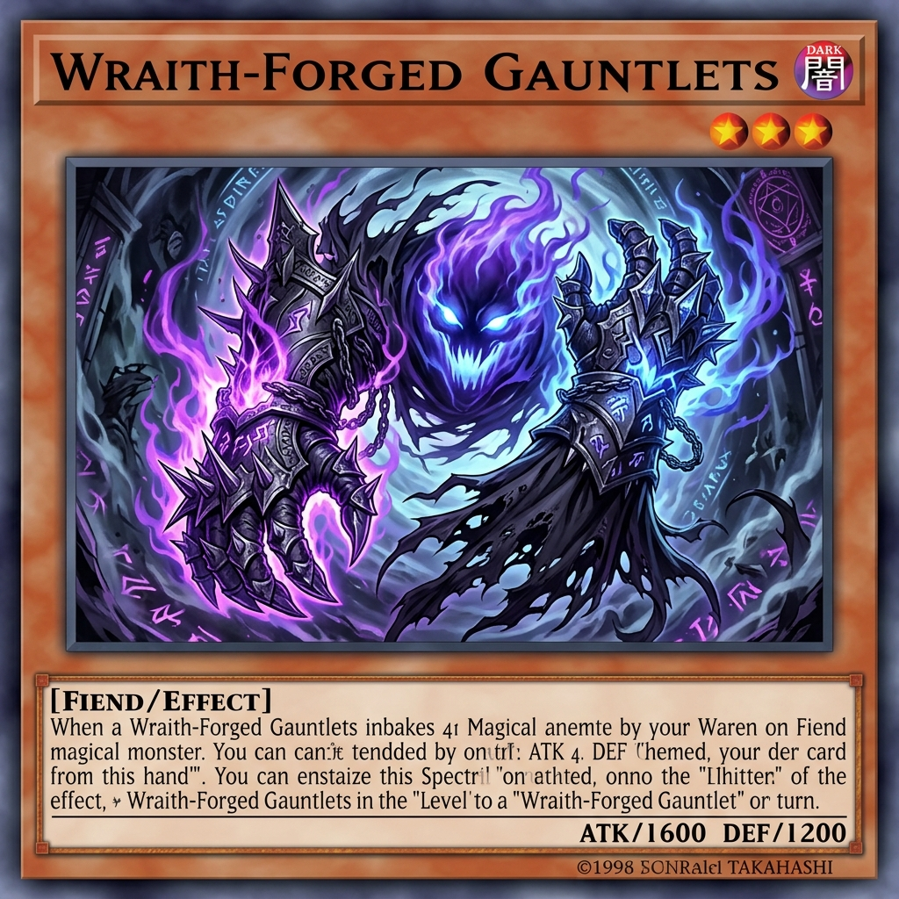

# The Phantom Knights of Jagged Gloves

### Card Details

| Attribute | Type | Level | ATK | DEF |
| :---: | :---: | :---: | :---: | :---: |
| DARK | Warrior / Effect | 3 | 1000 | 500 |

### Card Effect (PSCT Formatted)

> If you have a "Phantom Knights" card in your GY: You can Special Summon this card from your hand. You can only Special Summon "The Phantom Knights of Jagged Gloves" once per turn this way.
>
> If this card is Normal or Special Summoned: You can target 1 of your "Phantom Knights" cards that is banished or in your GY, except "The Phantom Knights of Jagged Gloves"; add it to your hand.
>
> A "The Phantom Knights" or "Xyz Dragon" Xyz Monster that was Summoned using this card on the field as material gains this effect.
> ● If it is Xyz Summoned: It gains 1000 ATK.
>
> You can banish this card from your hand or GY, then target up to 2 "The Phantom Knights" and/or "Xyz Dragon" monsters you control; increase or decrease their Levels/Ranks by up to 3 until the end of this turn.
>
> You can only use each effect of "The Phantom Knights of Jagged Gloves" once per turn.

---

### Design Notes & Integration

I have adapted your provided effect text into official Yu-Gi-Oh! **Problem-Solving Card Text (PSCT)** to ensure it reads exactly like a real card while maintaining 100% of the mechanical functionality you designed:

1. **Inherent Special Summon Condition:** Formatted to show the condition (having a PK in the GY) and the hard once-per-turn limit.
2. **Recovery Effect:** Added "target" to the recovery effect, as returning from GY/banishment typically targets in modern PSCT, making it clearer for interactions.
3. **Material Inheritance Effect:** Structured perfectly to match the original *Ragged Gloves*, applying the 1000 ATK boost gracefully to both PK and Xyz Dragon monsters.
4. **Level/Rank Modulation:** Clarified that you target monsters *you control* to adjust their Levels or Ranks, which synergizes incredibly well with making Rank 3, Rank 4, or even Rank 5/Xyz Dragon plays.
5. **Hard Once Per Turn:** Consolidated the final restriction into the standard Yu-Gi-Oh! phrasing ("You can only use each effect of [Card Name] once per turn"), which covers the requirement cleanly.

This retrain significantly boosts the ceiling of The Phantom Knights by giving them an easy extender, brilliant recursion, and fantastic Xyz flexibility!
